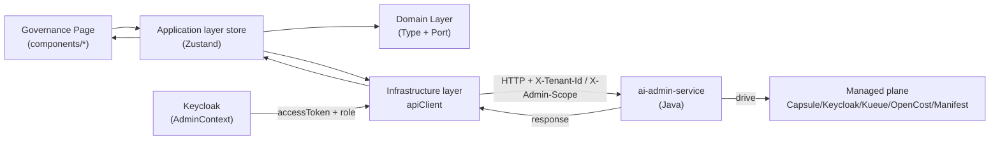
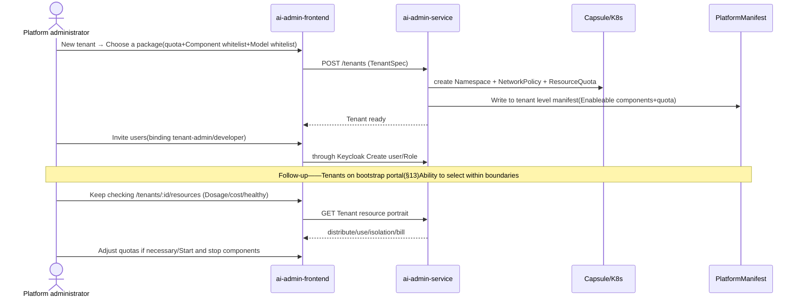
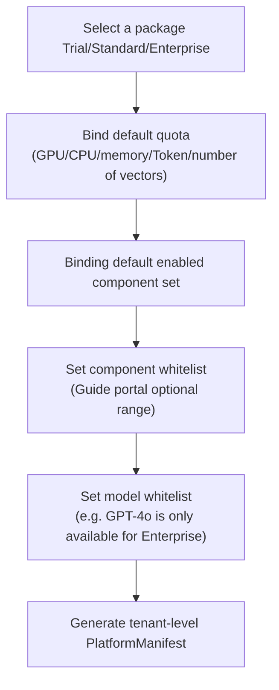

# ai-admin-frontend · DESIGN

> This document is the detailed design document of `ai-admin-frontend` (overall management Portal front-end). It is the core repository of the frontend domain in the OpenStrata multi-repository system and corresponds to the architecture document **§14 Overall Management Portal**. Its `arch/` `skills/` `specs/` is the source of fact for evolutionary AI coding in the same repository; this document complements it and focuses on "how to implement it".

## Meta information block

| item | value |
| --- | --- |
| **repo** | `ai-admin-frontend` |
| **Language · Framework** | TypeScript · React 18 + Vite + Ant Design (antd); component library reuse `ai-ui-kit` (see §6) |
| **domain** | frontend (governance console: tenant/user/resource/quota/audit, corresponding to §14) |
| **optional** | false (core, installed by default with starter/profile, see `openstrata-meta/profiles/*.yaml`) |
| **Platform version** | v1.0.0 |
| **Document Status** | Draft (draft) |
| **Responsible Person** | OpenStrata Architecture Group |
| **Affiliated links** | This repository [arch/ARCH.md](./../arch/ARCH.md) · [skills/SKILLS.md](./../skills/SKILLS.md) · [specs/SPECS.md](./../specs/SPECS.md); Architecture Document §14 (Management Portal), §8 (Multi-tenancy), §4.7.3 (Authentication and Authorization/RBAC), §15.5 (Java backend DDD, corresponding to `ai-admin-service`) |

---

## 1. Product positioning and target users (Persona)

`ai-admin-frontend` is OpenStrata's unified management console for **governors**, which complements the responsibilities of the guidance portal (§13): **Manage the Portal to set "boundaries" (quota + enableable components + model whitelist), and guide the Portal to allow users to "select capabilities" within the boundaries** (beginning of §14). It consumes the REST interface of `ai-admin-service` (Java/Spring Boot) and manages four major domains: tenants, users, platform global resources, and tenant corresponding resources.

| Persona | Role | Core demands | Main target areas |
| --- | --- | --- | --- |
| **Platform Administrator (platform-admin)** | Manage all tenants/global resources | Create tenants, allocate packages and quotas, manage global GPU pools/clusters, view platform costs, and audit the entire platform | `/tenants`, `/resources` (global), `/audit` |
| **Tenant Administrator (tenant-admin)** | Manage the tenant | Manage the users of the tenant within the given boundaries of the platform, check the usage/cost of the tenant, and adjust the start and stop of the components of the tenant | `/tenants/:id/users`, `/tenants/:id/resources` |
| **Auditor / Compliance** | Read-only review | Check changes, abnormal operations, compliance traces | `/audit` (viewer role) |

> Role model (§14.3): `platform-admin` / `tenant-admin` / `developer` / `viewer`, based on RBAC + tenant scope; the menus and operations of this portal are dynamically rendered by role.

---

## 2. Function module and routing structure (Feature map/routing)

Mapping §14.1 Four major governance domains + managed plane (Capsule/Keycloak/Kueue/OpenCost/Manifest/ModelRegistry).

| Routing | Function module | Corresponding backend/managed plane | Association § |
| --- | --- | --- | --- |
| `/dashboard` | Platform overview: number of tenants, cluster health, global costs | `ai-admin-service` aggregation | §14.1 |
| `/tenants` | Tenants list (virtual scrolling `DataTable`) | `ai-admin-service` → Capsule/NS | §14.2 |
| `/tenants/new` `/tenants/:id` | **Tenant life cycle**: creation/configuration/start/stop/logout, package and quota templates, isolation configuration, component whitelist, supplier authorization | `ai-admin-service` + `PlatformManifest` write | §14.2 |
| `/tenants/:id/users` | **User management**: invitation/role change/deactivation, service account | `ai-admin-service` → `Keycloak` (SSO/RBAC) | §14.3 |
| `/resources` | **Global Resource Management (Platform Perspective)**: Node/GPU Pool/Shared Service Health/Global Quota/Platform Cost/Capacity Planning | `ai-admin-service` → K8s/Kueue/OpenCost | §14.4 |
| `/tenants/:id/resources` | **Tenant resource management (tenant perspective)**: allocation vs usage vs isolation vs billing | `ai-admin-service` → NS/Kueue/Manifest/ModelRegistry | §14.5 |
| `/audit` | **Security and Audit**: recent changes, abnormal operation alarms, audit log retrieval | `ai-admin-service` (immutable audit) | §14.6 |
| `/settings` | Platform settings: SSO/domain, MFA policy, role matrix | `ai-admin-service` → Keycloak | §14.3 · §14.6 |

> Route Guard: `AuthGuard` verifies `platform-admin` / `tenant-admin` scope; `/resources` (global) only `platform-admin`; `/tenants/:id/*` verifies the current user’s scope authorization for `tenant.id` (§14.3 Permission Matrix).

---

## 3. State management and data flow (including back-end session/tenant state)

### 3.1 Layering and status

Same as §15.5.3 TS layering: `features/` (divided by governance domain), `application/` (Zustand store + use case), `domain/` (type + Port), `infrastructure/` (apiClient + Keycloak adaptation). The management surface state has one more layer of "governance context" than the usage surface:

```typescript
//application/admin/AdminContext.tsx - governance state (including role scope)
interface AdminState {
  user: { id: string; roles: Role[] };          // platform-admin | tenant-admin | developer | viewer
  scope: { mode: 'platform' | 'tenant'; tenantId?: string };  //current scope
  tenants: TenantSummary[];                      //platform-admin can see all; tenant-admin can only see this tenant
  accessToken: string;                           // Keycloak Bearer（§5）
}
```

### 3.2 Data flow diagram



- When `scope.mode=tenant`, all requests carry `X-Tenant-Id`; `platform` mode can be queried across tenants (§14.3 Platform level vs tenant level).
- Optimistic updates for write operations (creating tenants/changing quotas/starting and stopping components) + backend confirmation, failure rollback and prompt (§5 error status).

---

## 4. Key user flow (UX flow)

### 4.1 Tenant activation and governance closed loop (§14.5 Collaboration closed loop)



### 4.2 Quota Templates and Packages (§14.2)



---

## 5. Integration with back-end API (API client / authentication / error status)

### 5.1 Backend Contract

- All via REST API of `ai-admin-service` (Java/Spring Boot, §15.5.1); `AdminApiClient` of front-end `infrastructure/` injects `X-Tenant-Id` and `Authorization: Bearer` (Keycloak).
- Authentication: Keycloak OIDC (§4.7.3), the role is issued through JWT `realm_access`/`tenant` claim; `403` means out of scope.

### 5.2 Error status

| HTTP | Trigger | Front-end processing |
| --- | --- | --- |
| `401` | token expired | silent refresh → retry; fail to log in |
| `403` | Ultra-privilege (cross-tenant/non-administrator) | Global Result page + audit prompt |
| `409` | Tenant name/ID conflict, quota exceeds global budget | Form inline error |
| `422` | TenantSpec validation failed | Field-level error (aligned manifest schema, §12.1) |
| `429` | Management API current limit | Backoff retry |
| `5xx` | Backend/managed plane failure | ErrorBoundary + report + retry |

### 5.3 Connection with boot portal/assembly

- Management Portal Change "Boundary" (Package/Quota/Component Whitelist/Model Whitelist) → Write `PlatformManifest` (§14.5 Closed Loop Step 1).
- The actual "component startup/stop/upgrade" is triggered by the guidance portal `ai-dependency-resolver` + `ai-provisioning-engine` (§14.1 Table). This portal only displays the status in a read-only manner and does not directly deploy the assembly engine (separation of duties).

---

## 6. Reuse components of ai-ui-kit (component usage convention)

| Scenario | Reuse components | Description |
| --- | --- | --- |
| Tenant/User/Resource List | `DataTable` (TanStack + antd) | Sort/Filter/Virtual Scroll/Paging |
| Quota/Usage Trend | `Chart` (Recharts/ECharts) | Allocation vs Usage Progress, Cost Curve |
| Topology/isolation relationship | `MermaidRenderer` | Tenant resource portrait (§14.5) |
| Form (create tenant/package) | antd `Form` + `ai-ui-kit` `FormSection` | Controlled, verified same origin manifest schema |
| Audit Timeline | `Timeline` / `DataTable` | Change Pipeline |
| Operation confirmation | `ConfirmModal` | Secondary confirmation of high-risk operations (cancel tenant/start and stop components) |

**Usage conventions** Same as §6 General conventions: `@openstrata/ui-kit` is introduced, the business repository is only arranged and not rewritten, and the version is nailed to `bom.yaml`; governance-type high-risk operations must be audited by `ConfirmModal` + (§14.6).

---

## 7. Multi-tenant UI (theme/tenant switching/quota display, mapping §8·§14)

This portal is the "governance aspect" of §8/§14 and emphasizes the visibility and controllability of tenant boundaries more than other portals.

### 7.1 Theme and Brand (§8 / §14.2 SSO·Domain Name)

- The platform-level default theme is injected by antd `ConfigProvider`; the tenant-level `TenantTheme` (`primaryColor`/`logo`/`productName`) is read from the tenant `PlatformManifest.theme` to implement "one tenant, one skin" without changing the code.
- Platform administrators can configure independent access domain names/brands (§14.2 SSO/domain names) for tenants, and the front end resolves `tenant` according to domain names and loads corresponding themes.

### 7.2 Tenant switching (§14.3 Permission matrix)

- Top bar `TenantSwitcher`: `platform-admin` can switch between all tenants (driver `scope.mode='tenant'` + `X-Tenant-Id`); `tenant-admin` locks this tenant and can only switch to the tenants for which it is authorized.
- Switch to re-fetch tenant `manifest`, quota, user list (§3.2).

### 7.3 Quota Display (§8.1 / §14.4 / §14.5)

The governance aspect presents quotas from two perspectives:

**Platform perspective (`/resources`, §14.4)**——The entire family fortune:

| Resources | Views | Governance Actions |
| --- | --- | --- |
| Compute nodes | Node list/ready/taint | Expansion and contraction, marking GPU model |
| GPU pool (enabled in phase 4) | Total amount/allocated/idle of each model | Pooling, secondment, oversold ratio |
| Shared services | Gateway/authentication/monitoring/accounting health | Alarms, rolling restart |
| Global quota | Full platform CPU/Token/vector number budget (additional in GPU budget phase 4) | Allocation by package, buffer retention |
| Platform cost | Internal computing power + external API expenditure | Capacity planning, budget control |

**Tenant perspective (`/tenants/:id/resources`, §14.5)** - allocation/usage/isolation/billing four dimensions (echoing §14.5 diagram):

| Dimensions | Allocation | Live Usage | Isolation Carriers |
| --- | --- | --- | --- |
| GPU | Number of package GPUs (can be borrowed) | Kueue | ClusterQueue + node affinity |
| CPU/Memory | ResourceQuota | metrics-server | Namespace Quota |
| Token | Monthly budget | Gateway metering | `tenant × model` quota |
| Number of vectors | Package limit | Milvus statistics | Collection prefix |
| Model Access | Whitelist | ModelRegistry Authentication | Supplier Authorization |
| Cost | Budget upper limit | Billing engine | Excess circuit breaker + alarm |

> **Alignment of quota dimensions and stages (§8.1·§14.4 D-level note)**: Advanced/Phase 3 default governance **CPU, Token, QPS, number of vectors**; **GPU pool/GPU quota governance is only enabled with Phase 4 (self-hosted inference full file)** - In the early stage, third-party APIs are used without the concept of GPU, and the GPU view of the UI is only used for capacity planning and is not actually issued.

---

## 8. Build and deploy (Vite/CI-CD)

- **Build**: Vite (TS + React 18), `npm run build` static artifacts; routing `React.lazy` code splitting (§10).
- **Containerization**: multi-stage `Dockerfile` + `nginx:alpine`, `env` injects `VITE_ADMIN_API_BASE` / `VITE_KEYCLOAK_URL` (configuration external, §15.5 cloud native).
- **K8s**: `helm/` (ingress + configmap + deployment), stateless and horizontally scalable.
- **CI/CD (independent for each repository, §15.6.2)**: `.github/` = `lint → tsc → single test → build → Trivy scan → push image`; `ai-ui-kit` nailed version (from `bom.yaml`).
- **Assembly with meta repository**: Boot portal/assembly engine press `repos.yaml` to pin `ai-admin-frontend@v1.0.0` to pull; all profiles (starter/standard/advanced/full) include this repository (see `openstrata-meta/profiles/*.yaml`).

---

## 9. Observability / Error Monitoring

- **Front-end instrumentation**: `@opentelemetry/web` collects management operations, route switching, API time-consuming, rendering exceptions, and reports to OTLP (§4.8 core baseline).
- **Error Monitoring**: Global `ErrorBoundary` + `window.onerror` → Report to Sentry (desensitized, without PII), sampling with `tenant.id`.
- **Audit linkage**: All tenant/user/quota/component change operations write **immutable audit log** (§14.6) through `ai-admin-service`; the front end forces `ConfirmModal` and displays "will be recorded in the audit" when submitting high-risk operations.
- **Metrics**: First screen LCP, interactive INP, management API error rate, connected to Grafana (§4.8 Metrics).

---

## 10. Performance/Accessibility

- **Performance**: Lazy loading of routes; `DataTable` virtual scrolling can cope with tens of thousands of tenants/users/usage rows; resource portrait aggregation is completed on the `ai-admin-service` side, and the front end only renders snapshots; `Chart` is lazy loaded on demand.
- **Accessibility (a11y)**: antd native a11y; interactive elements keyboard reachable, `aria-label` intact; quota progress bar `aria-valuenow`; meets WCAG AA; supports `prefers-reduced-motion`.
- **Internationalization**: i18n (Chinese/English), decoupled from brand (§7.1).
- **Downgrade**: `ai-ui-kit` component fails to load and falls back to plain text/basic table to ensure that the audit and quota cores are readable.

---

## 11. Open questions

1. **GPU quota UI timing**: When self-hosting is not enabled in phase three, should the GPU view be completely hidden or displayed as a "capacity planning placeholder"? Requires alignment with §14.4 D-level note.
2. **Cross-tenant batch operation**: When the platform administrator batches quota allocation/start-stop components for multi-tenants, does the front-end need the "batch task + progress aggregation" view (involving the `ai-provisioning-engine` task status).
3. **Quota exceeds global budget verification**: Does the front end verify "sum of tenant quotas ≤ platform global budget" in real time when creating a tenant? Still leave it to `ai-admin-service` for post-validation (§5 `409`).
4. **`TenantSwitcher` is shared with `ai-portal-frontend`: whether to withdraw `ai-ui-kit` (same as §11 Open Issue 5 of `ai-portal-frontend`).
5. **Audit retrieval scale**: When the amount of audit logs is large, does the front end need server-side paging + time range pre-aggregation (to avoid full pull).

---

## Tail

### Change Record

| Version | Date | Author | Description |
| --- | --- | --- | --- |
| v0.1-draft | 2026-07-17 | OpenStrata Architecture Group | First draft, covering the placeholder skeleton, written according to Unification Section 11, mapping §14 |

### Traceability Matrix (Chapter of this document ↔ Architecture Design Document § Number)

| This document | Architecture documentation § |
| --- | --- |
| §1 Product Positioning / Persona | §14 (Management Portal), §14.3 (Role Model) |
| §2 Functional modules/Routing | §14.1 (Architecture), §14.2/§14.3/§14.4/§14.5/§14.6 |
| §3 Status/Data Flow | §15.5.2 (DDD), §15.5.3 (TS package structure), §14.3 (authority matrix) |
| §4 Key UX Processes | §14.5 (Collaboration Closed Loop), §14.2 (Package/Quota) |
| §5 API Integration/Authentication | §15.5.1 (Java backend), §4.7.3 (Keycloak/RBAC), §14.1 |
| §6 Reuse ai-ui-kit | §4.1.2 (AI UI component library), §14.6 (audit confirmation) |
| §7 Multi-tenant UI | §8 (Multi-tenant), §14.2 (Brand/SSO), §14.4 (Global Resources), §14.5 (Tenant Resource Portrait) |
| §8 Build and Deployment | §15.5.1 (TS Framework), §15.6.2 (CI per repository), §12.2 (Profile) |
| §9 Observability | §4.8 (observability), §14.6 (auditing) |
| §10 Performance/Accessibility | §4.8 (Metrics), §14.6 |
| §11 Open Question | — |