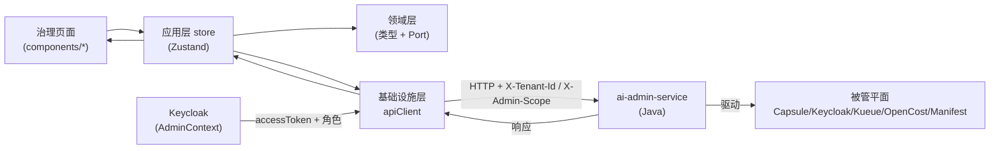
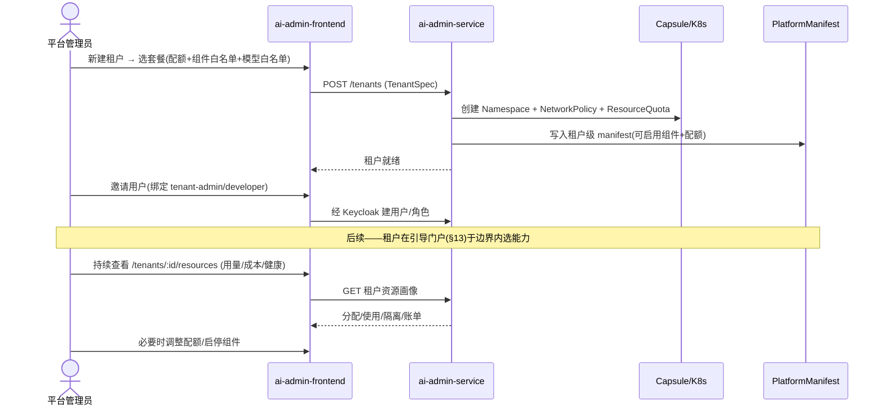
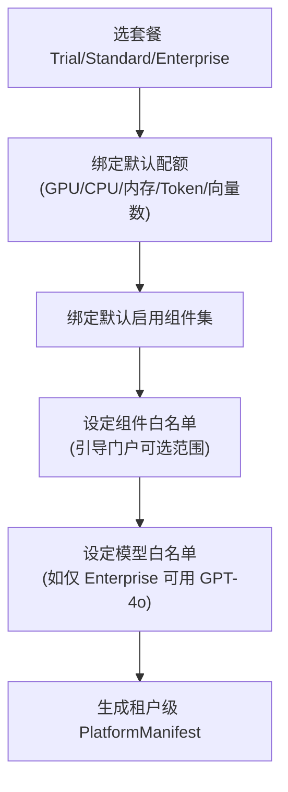

# ai-admin-frontend · 详细设计（DESIGN）

> 本文件为 `ai-admin-frontend`（整体管理 Portal 前端）的详细设计文档，是 OpenStrata 多仓体系中 frontend 域核心仓，对应架构文档 **§14 整体管理 Portal**。其 `arch/` `skills/` `specs/` 为同仓演化式 AI 编码事实源；本文档与之互补，聚焦"如何落地"。

## 元信息块

| 项 | 值 |
| --- | --- |
| **repo** | `ai-admin-frontend` |
| **语言·框架** | TypeScript · React 18 + Vite + Ant Design（antd）；组件库复用 `ai-ui-kit`（见 §6） |
| **领域（domain）** | frontend（治理控制台：租户/用户/资源/配额/审计，对应 §14） |
| **optional** | false（core，随 starter/profile 默认安装，见 `openstrata-meta/profiles/*.yaml`） |
| **平台版本** | v1.4.0 |
| **文档状态** | 草稿（draft） |
| **负责人** | OpenStrata 架构组 |
| **关联链接** | 本仓 [arch/ARCH.md](./../arch/ARCH.md) · [skills/SKILLS.md](./../skills/SKILLS.md) · [specs/SPECS.md](./../specs/SPECS.md)；架构文档 §14（管理 Portal）、§8（多租户）、§4.7.3（认证授权/RBAC）、§15.6（Java 后端 DDD，对应 `ai-admin-service`） |

---

## 1. 产品定位与目标用户（Persona）

`ai-admin-frontend` 是 OpenStrata 面向**治理者**的统一管理控制台，与引导门户（§13）职责互补：**管理 Portal 设定"边界"（配额 + 可启用组件 + 模型白名单），引导 Portal 在边界内让用户"自选能力"**（§14 开篇）。它消费 `ai-admin-service`（Java/Spring Boot）的 REST 接口，治理四大域：租户、用户、平台全局资源、租户对应资源。

| Persona | 角色 | 核心诉求 | 主要落地区域 |
| --- | --- | --- | --- |
| **平台管理员（platform-admin）** | 管所有租户/全局资源 | 创建租户、分配套餐与配额、管全局 GPU 池/集群、看平台成本、审计全平台 | `/tenants`、`/resources`（全局）、`/audit` |
| **租户管理员（tenant-admin）** | 管本租户 | 在平台给定边界内管本租户用户、看本租户用量/成本、调整本租户组件启停 | `/tenants/:id/users`、`/tenants/:id/resources` |
| **审计员 / 合规** | 只读审视 | 查变更、异常操作、合规留痕 | `/audit`（viewer 角色） |

> 角色模型（§14.3）：`platform-admin` / `tenant-admin` / `developer` / `viewer`，基于 RBAC + 租户作用域；本门户菜单与操作按角色动态渲染。

---

## 2. 功能模块与路由结构（Feature map / routing）

映射 §14.1 四大治理域 + 被管平面（Capsule/Keycloak/Kueue/OpenCost/Manifest/ModelRegistry）。

| 路由 | 功能模块 | 对应后端 / 被管平面 | 关联 § |
| --- | --- | --- | --- |
| `/dashboard` | 平台总览：租户数、集群健康、全局成本 | `ai-admin-service` 聚合 | §14.1 |
| `/tenants` | 租户列表（虚拟滚动 `DataTable`） | `ai-admin-service` → Capsule/NS | §14.2 |
| `/tenants/new` `/tenants/:id` | **租户生命周期**：创建/配置/启停/注销、套餐与配额模板、隔离配置、组件白名单、供应商授权 | `ai-admin-service` + `PlatformManifest` 写 | §14.2 |
| `/tenants/:id/users` | **用户管理**：邀请/角色变更/停用、服务账号 | `ai-admin-service` → `Keycloak`（SSO/RBAC） | §14.3 |
| `/resources` | **全局资源管理（平台视角）**：节点/GPU 池/共享服务健康/全局配额/平台成本/容量规划 | `ai-admin-service` → K8s/Kueue/OpenCost | §14.4 |
| `/tenants/:id/resources` | **租户资源管理（租户视角）**：分配 vs 使用 vs 隔离 vs 账单 | `ai-admin-service` → NS/Kueue/Manifest/ModelRegistry | §14.5 |
| `/audit` | **安全与审计**：最近变更、异常操作告警、审计日志检索 | `ai-admin-service`（不可变审计） | §14.6 |
| `/settings` | 平台设置：SSO/域名、MFA 策略、角色矩阵 | `ai-admin-service` → Keycloak | §14.3 · §14.6 |

> 路由守卫：`AuthGuard` 校验 `platform-admin` / `tenant-admin` 作用域；`/resources`（全局）仅 `platform-admin`；`/tenants/:id/*` 校验当前用户对该 `tenant.id` 的作用域授权（§14.3 权限矩阵）。

---

## 3. 状态管理与数据流（含与后端会话/租户态）

### 3.1 分层与状态

同 §15.6.3 TS 分层：`features/`（按治理域切分）、`application/`（Zustand store + 用例）、`domain/`（类型 + Port）、`infrastructure/`（apiClient + Keycloak 适配）。管理面状态比使用面多一层"治理上下文"：

```typescript
// application/admin/AdminContext.tsx —— 治理态（含角色作用域）
interface AdminState {
  user: { id: string; roles: Role[] };          // platform-admin | tenant-admin | developer | viewer
  scope: { mode: 'platform' | 'tenant'; tenantId?: string };  // 当前作用域
  tenants: TenantSummary[];                      // platform-admin 可见全部；tenant-admin 仅本租户
  accessToken: string;                           // Keycloak Bearer（§5）
}
```

### 3.2 数据流示意



- `scope.mode=tenant` 时所有请求带 `X-Tenant-Id`；`platform` 模式可跨租户查询（§14.3 平台级 vs 租户级）。
- 写操作（创建租户/改配额/启停组件）乐观更新 + 后端确认，失败回滚并提示（§5 错误态）。

---

## 4. 关键用户流程（UX flow）

### 4.1 租户开通与治理闭环（§14.5 协作闭环）



### 4.2 配额模板与套餐（§14.2）



---

## 5. 与后端 API 的集成（API client / 鉴权 / 错误态）

### 5.1 后端契约

- 全部经 `ai-admin-service`（Java/Spring Boot，§15.6.1）的 REST API；前端 `infrastructure/` 的 `AdminApiClient` 注入 `X-Tenant-Id` 与 `Authorization: Bearer`（Keycloak）。
- 鉴权：Keycloak OIDC（§4.7.3），角色经 JWT `realm_access`/`tenant` claim 下发；`403` 表示越作用域。

### 5.2 错误态

| HTTP | 触发 | 前端处理 |
| --- | --- | --- |
| `401` | token 过期 | 静默 refresh → 重试；失败跳登录 |
| `403` | 越权（跨租户/非管理员） | 全局 Result 页 + 审计提示 |
| `409` | 租户名/ID 冲突、配额超全局预算 | 表单内联错误 |
| `422` | TenantSpec 校验失败 | 字段级错误（对齐 manifest schema，§12.1） |
| `429` | 管理 API 限流 | 退避重试 |
| `5xx` | 后端/被管平面故障 | ErrorBoundary + 上报 + 重试 |

### 5.3 与引导门户/装配的衔接

- 管理 Portal 改"边界"（套餐/配额/组件白名单/模型白名单）→ 写 `PlatformManifest`（§14.5 闭环第 1 步）。
- 实际"组件启停/升级"由引导门户触发 `ai-dependency-resolver` + `ai-provisioning-engine`（§14.1 表），本门户只读展示状态，不直接调装配引擎（职责分离）。

---

## 6. 复用 ai-ui-kit 的组件（组件使用约定）

| 场景 | 复用组件 | 说明 |
| --- | --- | --- |
| 租户/用户/资源列表 | `DataTable`（TanStack + antd） | 排序/筛选/虚拟滚动/分页 |
| 配额/用量趋势 | `Chart`（Recharts/ECharts） | 分配 vs 使用进度、成本曲线 |
| 拓扑/隔离关系 | `MermaidRenderer` | 租户资源画像图（§14.5） |
| 表单（创建租户/套餐） | antd `Form` + `ai-ui-kit` `FormSection` | 受控、校验同源 manifest schema |
| 审计时间线 | `Timeline` / `DataTable` | 变更流水 |
| 操作确认 | `ConfirmModal` | 高危操作（注销租户/启停组件）二次确认 |

**使用约定**同 §6 通用约定：`@openstrata/ui-kit` 引入、业务仓只编排不重写、版本钉死 `bom.yaml`；治理类高危操作必须经 `ConfirmModal` + 审计（§14.6）。

---

## 7. 多租户 UI（主题 / 租户切换 / 配额展示，映射 §8·§14）

本门户是 §8/§14 的"治理面"，比其他门户更强调租户边界的可视化与可控性。

### 7.1 主题与品牌（§8 / §14.2 SSO·域名）

- 平台级默认主题由 antd `ConfigProvider` 注入；租户级 `TenantTheme`（`primaryColor`/`logo`/`productName`）从租户 `PlatformManifest.theme` 读取，实现"一租户一皮肤"而不改代码。
- 平台管理员可为租户配置独立访问域名/品牌（§14.2 SSO/域名），前端按域名解析 `tenant` 并加载对应主题。

### 7.2 租户切换（§14.3 权限矩阵）

- 顶栏 `TenantSwitcher`：`platform-admin` 可在全部租户间切换（驱动 `scope.mode='tenant'` + `X-Tenant-Id`）；`tenant-admin` 锁定本租户，仅能切到自己被授权的租户。
- 切换即重取租户 `manifest`、配额、用户列表（§3.2）。

### 7.3 配额展示（§8.1 / §14.4 / §14.5）

治理面分两视角呈现配额：

**平台视角（`/resources`，§14.4）**——整盘家底：

| 资源 | 视图 | 治理动作 |
| --- | --- | --- |
| 计算节点 | 节点列表/就绪/污点 | 扩缩容、打标 GPU 型号 |
| GPU 池（阶段四启用） | 各型号总量/已分配/空闲 | 池化、借调、超卖比 |
| 共享服务 | 网关/认证/监控/计费健康 | 告警、滚动重启 |
| 全局配额 | 全平台 CPU/Token/向量数预算（GPU 预算阶段四追加） | 按套餐分配、留缓冲 |
| 平台成本 | 内部算力 + 外部 API 支出 | 容量规划、预算管控 |

**租户视角（`/tenants/:id/resources`，§14.5）**——分配/使用/隔离/账单四维（呼应 §14.5 图）：

| 维度 | 分配 | 实时使用 | 隔离载体 |
| --- | --- | --- | --- |
| GPU | 套餐 GPU 数（可借调） | Kueue | ClusterQueue + 节点亲和 |
| CPU/内存 | ResourceQuota | metrics-server | Namespace Quota |
| Token | 月度预算 | 网关计量 | `tenant × model` 配额 |
| 向量数 | 套餐上限 | Milvus 统计 | Collection 前缀 |
| 模型访问 | 白名单 | ModelRegistry 鉴权 | 供应商授权 |
| 成本 | 预算上限 | 计费引擎 | 超额熔断 + 告警 |

> **配额维度与阶段对齐（§8.1·§14.4 D-level 注）**：advanced/阶段三默认治理 **CPU、Token、QPS、向量数**；**GPU 池 / GPU 配额治理随阶段四（自托管推理 full 档）才启用**——前期用第三方 API 无 GPU 概念，UI 的 GPU 视图仅作容量规划占位，不实际下发。

---

## 8. 构建与部署（Vite / CI-CD）

- **构建**：Vite（TS + React 18），`npm run build` 静态产物；路由 `React.lazy` 代码分割（§10）。
- **容器化**：多阶段 `Dockerfile` + `nginx:alpine`，`env` 注入 `VITE_ADMIN_API_BASE` / `VITE_KEYCLOAK_URL`（配置外置，§15.6 云原生）。
- **K8s**：`helm/`（ingress + configmap + deployment），无状态、可水平扩容。
- **CI/CD（每仓独立，§15.7.2）**：`.github/` = `lint → tsc → 单测 → build → Trivy 扫描 → 推送镜像`；`ai-ui-kit` 钉版本（来自 `bom.yaml`）。
- **与元仓装配**：引导门户/装配引擎按 `repos.yaml` 钉 `ai-admin-frontend@v1.4.0` 拉取；所有 profile（starter/standard/advanced/full）均含本仓（见 `openstrata-meta/profiles/*.yaml`）。

---

## 9. 可观测性 / 错误监控

- **前端埋点**：`@opentelemetry/web` 采集管理操作、路由切换、API 耗时、渲染异常，上报 OTLP（§4.8 core 基线）。
- **错误监控**：全局 `ErrorBoundary` + `window.onerror` → 上报 Sentry（脱敏、不含 PII），采样带 `tenant.id`。
- **审计联动**：所有租户/用户/配额/组件变更操作经 `ai-admin-service` 写**不可变审计日志**（§14.6）；前端在提交高危操作时强制 `ConfirmModal` 并展示"将记入审计"。
- **指标**：首屏 LCP、交互 INP、管理 API 错误率，接入 Grafana（§4.8 Metrics）。

---

## 10. 性能 / 无障碍

- **性能**：路由懒加载；`DataTable` 虚拟滚动应对万级租户/用户/用量行；资源画像聚合在 `ai-admin-service` 侧完成，前端只渲染快照；`Chart` 按需懒加载。
- **无障碍（a11y）**：antd 原生 a11y；交互元素键盘可达、`aria-label` 完整；配额进度条带 `aria-valuenow`；满足 WCAG AA；支持 `prefers-reduced-motion`。
- **国际化**：i18n（中/英），与品牌解耦（§7.1）。
- **降级**：`ai-ui-kit` 组件加载失败回退纯文本/基础表格，保证审计与配额核心可读。

---

## 11. 开放问题

1. **GPU 配额 UI 时机**：阶段三未启用自托管时，GPU 视图应完全隐藏还是以"容量规划占位"展示？需与 §14.4 D-level 注对齐确认。
2. **跨租户批量操作**：平台管理员对多租户批量调配额/启停组件，前端是否需要"批量任务 + 进度聚合"视图（涉及 `ai-provisioning-engine` 任务状态）。
3. **配额超全局预算校验**：前端创建租户时是否实时校验"租户配额之和 ≤ 平台全局预算"？还是交给 `ai-admin-service` 后置校验（§5 `409`）。
4. **`TenantSwitcher` 与 `ai-portal-frontend` 共享**：是否抽回 `ai-ui-kit`（同 §11 开放问题 5 of `ai-portal-frontend`）。
5. **审计检索规模**：审计日志量大时前端是否需要服务端分页 + 时间范围预聚合（避免全量拉取）。

---

## 尾部

### 变更记录

| 版本 | 日期 | 作者 | 说明 |
| --- | --- | --- | --- |
| v0.1-draft | 2026-07-17 | OpenStrata 架构组 | 初稿，覆盖占位骨架，按统一 11 节撰写，映射 §14 |

### 追溯矩阵（本文档章节 ↔ 架构设计文档 § 编号）

| 本文档 | 架构文档 § |
| --- | --- |
| §1 产品定位 / Persona | §14（管理 Portal）、§14.3（角色模型） |
| §2 功能模块 / 路由 | §14.1（架构）、§14.2/§14.3/§14.4/§14.5/§14.6 |
| §3 状态 / 数据流 | §15.6.2（DDD）、§15.6.3（TS 包结构）、§14.3（权限矩阵） |
| §4 关键 UX 流程 | §14.5（协作闭环）、§14.2（套餐/配额） |
| §5 API 集成 / 鉴权 | §15.6.1（Java 后端）、§4.7.3（Keycloak/RBAC）、§14.1 |
| §6 复用 ai-ui-kit | §4.1.2（AI UI 组件库）、§14.6（审计确认） |
| §7 多租户 UI | §8（多租户）、§14.2（品牌/SSO）、§14.4（全局资源）、§14.5（租户资源画像） |
| §8 构建与部署 | §15.6.1（TS 框架）、§15.7.2（每仓 CI）、§12.2（Profile） |
| §9 可观测性 | §4.8（可观测性）、§14.6（审计） |
| §10 性能 / 无障碍 | §4.8（Metrics）、§14.6 |
| §11 开放问题 | — |